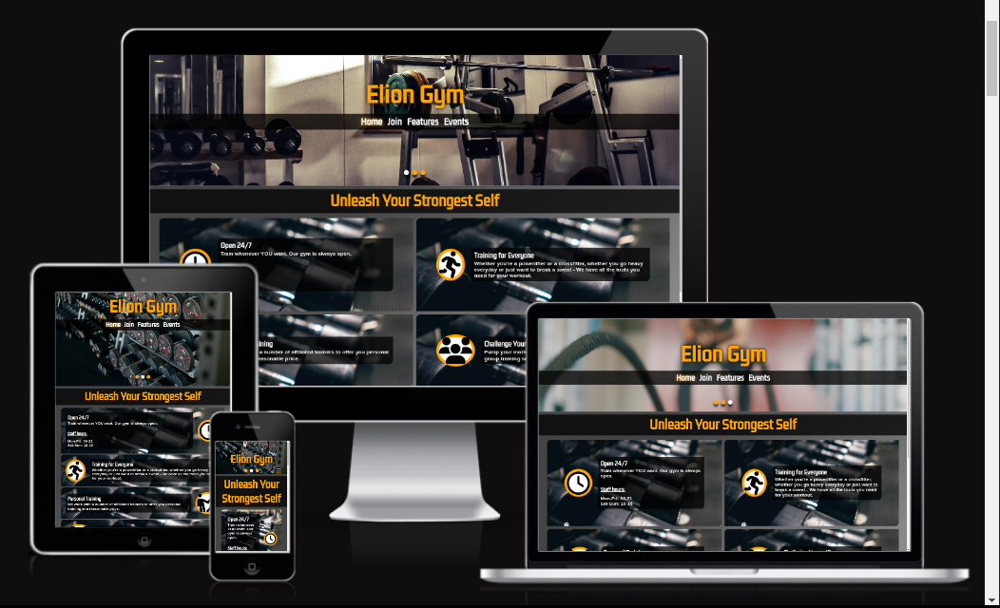
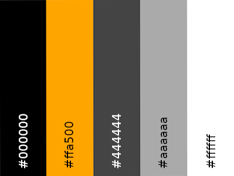
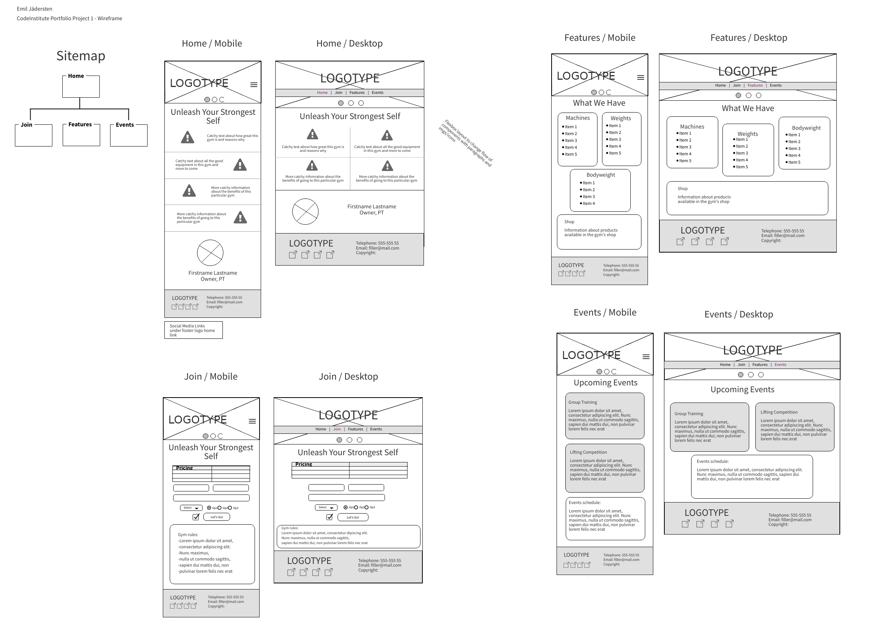

# ELION GYM

This is a simple website designed with responsive functionality as a central priority. The goal is to give visitors a good browsing experience on a variety of devices and help the owner to get new customers.

Elion Gym is a medium-size gym in a fairly big city. Due to the stiff competition with other gyms, the owner wants to communicate better what sets his gym apart and draw more new members to the gym. The site is designed with the intention to quickly get all relevant information across while also giving the viewer a sense of what it's like to be at the gym.

[View the Elion Gym website here](https://emilionr.github.io/portfolio-project-1/)
For educational purposes only, NOT a real gym. I made this as my first portfolio project for Code Institute.

## Contents

* [Features](#Features)
  * [Existing Features](#existing-features)
    * [Home page](#home-page)
    * [Sign-up page](#sign-up-page)
    * [Features page](#features-page)
    * [Events page](#events-page)
    * [Confirmation page](#confirmation-page)
  * [Future Implementations](#future-implementations)

* [User Experience](#User-Experience)
  * [User Stories](#User-Stories)

* [Deployment](#Deployment)

* [Design](#Design)
  * [Colour Scheme](#Colour-Scheme)
  * [Typography](#Typography)
  * [Images](#Images)
  * [Wireframe](#wireframe)
  * [Accessibility](#Accessibility)

* [Technologies Used](#Technologies-Used)
  * [Languages Used](#Languages-Used)
  * [Frameworks, Libraries & Programs Used](#frameworks-libraries--programs-used)

* [Testing](#Testing)
  * [Solved Bugs](#solved-bugs)
  * [Known Bugs](#unfixed-bugs)
  
* [Credits](#Credits)
  * [Content](#Content)
  * [Media](#Media)
  * [Tutorials & Code Used](#tutorials--code-used)

## Features

### Existing Features

The site has four main pages accessible via the navigation menu, plus one confirmation page for signing up. The latter is only accessible by filling out the sign-up form and can not be reached via the navigation menu.

All pages on the website have:
  * A header with a navigation menu, containing links to each of the four pages. The current page lights up in the menu. Navigation is always visible in a horizontal strip on bigger screens. On smaller screens, it turns into a dropdown menu which is hidden until opened by a traditional burger toggle. This is meant to avoid clutter and make navigation intuitive regardless of screen size.
  * A footer with another home link, a set of contact details, links to social media pages, and copyright information. The links are inside icons to reduce clutter and to let the viewer know instantly what they're looking at.

#### Home Page:

__The home page has:__
  * Four panels of information such as business hours and selling points, giving the brief and snappy version of what sets the gym apart.
  * A message from the owner, to provide the viewer a face and a feel for the vibe of the gym.
#### Sign-up Page:

__The sign-up page has:__
  * Information about the costs of joining the gym and what's included in the price.
  * A form for signing a new membership.
  * A panel with the rules of the gym.
#### Features Page:

__The features page has:__
  * Three panels listing the diverse excercise equipment found inside the gym.
  * A list of products sold at the gym and their prices.
#### Events Page:

__The events page has:__
  * Two panels about upcoming events.
  * An information panel about scheduled events.
#### Confirmation Page:

__The home page has:__
  * A message thanking the user for signing up and informing them about the next steps to take.
  * A button for returning to the home page.

### Future Implementations:

If I were to take this project up again and flesh out the website, I would add: 

  * A a carousel for user testimonials/reviews on the landing page.
  * A page about the staff.
  * A blog page for news and content marketing purposes.

## User Experience

__Key information for the site__

* When the gym is open.
* Membership pricing.
* What equipment exists at the gym.
* Events taking place at the gym.
* How to become a member.

### User stories

__Client goals__

* Make it easy for visitors to see what the gym can offer.
* Make it easy for potential customers to sign up for membership.
* Provide all relevant contact information and social media channels.
* Reach the audience regardless of device used to view the site.

__First-time visitor goals__

* I want to get all the info about this gym, its equipment and open hours.
* I want to navigate the site with ease on any device.
* I want to find any relevant social media channels.
* I want to sign up for membership if I like the gym.

__Returning visitor goals__

* I want to know what's happening at the gym.
* I want an easy way to contact the gym.

## Design

### Color palette

For this site, I wanted a strong, striking impression and found inspiration from the packaging of popular workout supplements. I wanted mostly grayscale with a single sharp red or orange color. After some initial testing, I chose orange due to better contrast.

### Typography

I used Google Fonts for these fonts:

Kdam Thmor Pro for all headings and some emphasized text. It's a bold sans-serif font.

### Images

I used a combination of royalty-free pictures from Unsplash and Pexels, along with one AI-generated portrait.
Credits for photos are found in the Credits section.

### Wireframe

I made wireframes for mobile and desktop versions of each page. I had a firm plan and stayed mostly true to the wireframe. However, I had to make some slight changes to the positioning of banner contents, as well as the list containers on the features page.

### Accessibility

I designed this website with accessibility in mind, using the following procedures:

Using semantic HTML.
Using descriptive alt attributes on images.
Giving screen readers information about sections, buttons, and link icons.
Using aria-current and aria-label to help screen readers know where the user is.
Ensuring a sufficient colour contrast for viewers with visual impairments such as color-blindness.

## Technologies Used

### Languages Used

This website was made with HTML and CSS, with no additional libraries.

### Frameworks, Libraries, & Programs used

VSCode - Used for all the coding.

Git - For version control.

GitHub - To store files and provide a live site.

Google Fonts - For stylish headings.

Font Awesome - For icons used throughout the site.

Google Dev Tools - For debugging and trying out design improvements on the fly.

GNU Image Manipulation Program - Cropping and scaling images for faster load times.

Cloud Convert - For compressing images to webp for even faster page loading.

Favicon.io - I used this to make the page favicon.

Am I Responsive - For testing how the site looks on different devices.

WAVE Evaluation Tool - To check accessibility.

Web Disability Simulator - To check accessibility.

## Deployment

The page was deployed with GitHub Pages, using the following procedure:
1. First, go to the Settings tab of this repository.
2. Select the Master branch from the source section dropdown menu.
3. The page automatically refreshes and confirms the successful deployment.ment

## Testing

Please refer to [TESTING.md](documentation/TESTING.md) for testing documentation.

### Solved Bugs

1. An interaction between the header and main section would cause the body to either overflow out the bottom past the footer, or cut the footer in half on mobile devices. This was fixed by adjusting the height of the main section and the overflow of the header.
2. Header images would cut out or cause horizontal overflows making the whole page scroll to the side with nothing but empty space outside the main design. This happened because I used the overflow settings on the header instead of the image container inside the header. Designing the image slider with pure CSS requires some strange workarounds, as it is usually done with Javascript.
3. Text lines would break in bad places or extend outside panels when sizing down between tablet and phone screen sizes. I solved this by adjusting the padding and flex properties of the elements containing the affected text.
4. Footer contents would scramble and end up in the wrong order on small screen sizes. I solved this by arranging contents in separate dividers for rows and creating a reusable line-break element for flex layouts.
5. Header contents would move out of position and fight for space at certain screen sizes. This was solved when I changed the margins and paddings from percentages to specific numbers.

### Unfixed Bugs

On certain smartphone screens, navigation links may be temporarily displaced vertically by a few pixels if the user turns the phone while the navigation menu is open. It has no impact on interactions and I only encountered this bug on one phone (Galaxy S22). When trying to replicate it on other phones or in the dev tools inspector, everything was normal.

During peer review, I was told that the footer may come up from the bottom of the screen on the events page when viewed on a small tablet screen. I could not replicate this result during testing.

## Credits

### Content

All content is original.

### Media

**Images used**

"empty-gym.webp" [Photo by Jelmer Assink](https://unsplash.com/photos/barbell-on-rack-gzeTjGu3b_k?utm_content=creditCopyText&utm_medium=referral&utm_source=unsplash)

"weight-rack" [Photo by Ivan Samkov](https://www.pexels.com/sv-se/foto/gym-utrustning-hantlar-hantel-4162451/)

"ropes.webp" [Photo by Chase Kinney](https://unsplash.com/photos/person-holding-black-exercise-rope-FMQBLyhD2HU?utm_content=creditCopyText&utm_medium=referral&utm_source=unsplash)

"group-training.webp" [Photo by Victor Freitas](https://unsplash.com/photos/person-about-to-lift-the-weight-plate-Btl6ZNdIfdQ?utm_content=creditCopyText&utm_medium=referral&utm_source=unsplash)

"lifting-comp.webp" [Photo by](https://unsplash.com/photos/a-man-lifting-a-barbell-in-a-gym-71T4vSUphQI?utm_content=creditCopyText&utm_medium=referral&utm_source=unsplash)

"dumbbells.webp" [Photo by Samuel Girven](https://unsplash.com/photos/dumbbells-on-floor-VJ2s0c20qCo?utm_content=creditCopyText&utm_medium=referral&utm_source=unsplash)

"owner.webp" Image generated with [Picsart](https://picsart.com/)

### Tutorials & Code Used

While I did not directly copy anything, I took a lot of inspiration from [Theodore Coding's image slider tutorial](https://www.youtube.com/watch?v=Ll5JIjdwQEM) when making my header image slides.