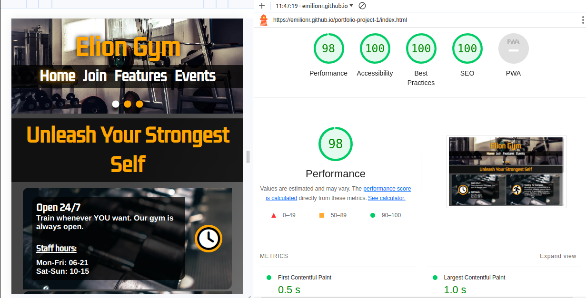

# ELION GYM - TESTING

Visit live deployed site: [Elion Gym](https://emilionr.github.io/portfolio-project-1/)

* [Automated Testing](#automated-testing)
  * [Validator Testing](#validator-testing)
  * [Lighthouse](#lighthouse)
* [Manual Testing](#manual-testing)
  * [Testing User Stories](#testing-user-stories)
  * [Full Testing](#full-testing)

I frequently tested all pages throughout the development process. Most of this testing was done with the dev tools in my browser.

Throughout development, I would resize the viewports and try to abuse the pages to see if something would break the layout and whether the site was responsive enough.

The console and various tabs of the dev tools helped me find errors and warnings and deal with them accordingly.

## Automated Testing

### Validator Testing

No errrors reported by W3C validators.

* HTML
  * [Home page](https://validator.w3.org/nu/?doc=https%3A%2F%2Femilionr.github.io%2Fportfolio-project-1%2F)
  * [Sign-up page](https://validator.w3.org/nu/?doc=https%3A%2F%2Femilionr.github.io%2Fportfolio-project-1%2Fjoin.html)
  * [Features page](https://validator.w3.org/nu/?doc=https%3A%2F%2Femilionr.github.io%2Fportfolio-project-1%2Ffeatures.html)
  * [Events page](https://validator.w3.org/nu/?doc=https%3A%2F%2Femilionr.github.io%2Fportfolio-project-1%2Fevents.html)
  * [Confirmation page](https://validator.w3.org/nu/?doc=https%3A%2F%2Femilionr.github.io%2Fportfolio-project-1%2Fthanks.html)
* CSS
  * [Style.css](https://jigsaw.w3.org/css-validator/validator?uri=https%3A%2F%2Femilionr.github.io%2Fportfolio-project-1%2Fthanks.html&profile=css3svg&usermedium=all&warning=1&vextwarning)

### Lighthouse

Using Google's Lighthouse, I tested the site for performance, accessibility, best practices, and SEO. After assessing the initial score and making some small adjustments, it now comes in at 96% for performance, and 100% for everything else.

Closing those last few percent of performance would not be feasible using these technologies and within the context of this simple HTML+CSS project.

While testing for mobile gave a somewhat lower and more inconsistent reading for performance, this is mostly due to Lighthouse's emulation of poor 3g/wifi connectivity and only represents a worst-case scenario.

## Manual Testing

### Testing User Stories

__Client goals__

| Goals | How are they achieved? |
| :--- | :--- |
| Make it easy for visitors to see what the gym can offer. | Selling points and key information is presented on the home page in eye-catching panels with colorful icons. |
| Make it easy for potential customers to sign up for membership. | The "Join" page has an intuitive sign-up form and panels with all relevant information about membership. |
| Provide all relevant contact information and social media channels. | All of this is found in the footer and can thus be accessed from every page. |
| Reach the audience regardless of device used to view the site. | The layout adapts to give the right flow of information on all screen sizes. |

__First Time Visitors__

| Goals | How are they achieved? |
| :--- | :--- |
| I want to get all the info about this gym, its equipment and open hours. | Elion Gym has all the info, presenting the key takeaways on the home page and sorting detailed information on dedicated pages. |
| I want to navigate the site with ease on any device. | The site has a highly responsive design with very straightforward navigation that adapts for easy use on all devices. |
| I want to find any relevant social media channels. | Links to social media are present in the form of icons in the footer of the page, making them intuitive and easy to access from anywhere on the page |
| I want to sign up for membership if I like the gym. | Elion Gym has a functional signup form on a dedicated page with a very conspicuous link in the navigation bar. |  

__Returning Visitors__

|  Goals | How are they achieved? |
| :--- | :--- |
| I want to know what's happening at the gym. | The event page contains news and information about upcoming events |
| I want an easy way to contact the gym. | Contact information is ever-present in the footer |

### Full Testing

I thoroughly tested every part of this website, and also sent the link for testing to fellow students.

My manual testing consisted of clicking everything possible, resizing the viewport into all possible sizes and proportions, checking dev tools for warnings and dead CSS. I also did a lot of testing on my phone while changing the orientation.

I repeated this process every time I implemented a new feature or changed anything major about existing features. Plus, I tried to interact with things in ways that were never intended just to make sure nothing breaks if someone were to do so on accident.

The site was tested on these devices:
* Computer:
  * 14" Lenovo Thinkpad T480
  * 22" Gaming PC display
* Mobile
  * Samsung Galaxy S23
  * Samsung Galaxy S22
  * Samsung Galaxy S9
  * Motorola Moto G73 5g

The site was also tested in a number of browsers, including:

* Google Chrome
* Mozilla Firefox
* Brave
* Samsung Internet
* Microsoft Edge
* Safari

I put the site up for peer review and received feedback about a bug that causes the footer to leave the bottom of the screen at specific viewport dimensions. I could not replicate this bug but attempted to fix the position more firmly.