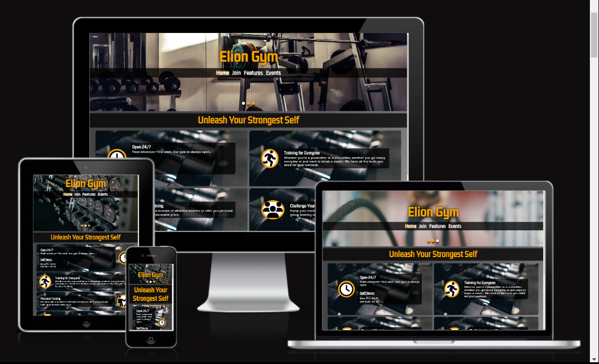

# ELION GYM - TESTING

Visit live deployed site: [Elion Gym](https://emilionr.github.io/portfolio-project-1/)

* [Automated Testing](#automated-testing)
  * [Validator Testing](#validator-testing)
  * [Lighthouse](#lighthouse)
* [Manual Testing](#manual-testing)
  * [Testing User Stories](#testing-user-stories)
  * [Full Testing](#full-testing)

I frequently tested all pages throughout the development process. Most of this testing was done with the dev tools in my browser.

Throughout development, I would resize the viewports and try to abuse the pages to see if something would break the layout and whether the site was responsive enough.

The console and various tabs of the dev tools helped me find errors and warnings and deal with them accordingly.

## Automated Testing

### Validator Testing

No errrors reported by W3C validators.

* HTML
  * [Home page](https://validator.w3.org/nu/?doc=https%3A%2F%2Femilionr.github.io%2Fportfolio-project-1%2F)
  * [Sign-up page](https://validator.w3.org/nu/?doc=https%3A%2F%2Femilionr.github.io%2Fportfolio-project-1%2Fjoin.html)
  * [Features page](https://validator.w3.org/nu/?doc=https%3A%2F%2Femilionr.github.io%2Fportfolio-project-1%2Ffeatures.html)
  * [Events page](https://validator.w3.org/nu/?doc=https%3A%2F%2Femilionr.github.io%2Fportfolio-project-1%2Fevents.html)
  * [Confirmation page](https://validator.w3.org/nu/?doc=https%3A%2F%2Femilionr.github.io%2Fportfolio-project-1%2Fthanks.html)
* CSS
  * [Style.css](https://jigsaw.w3.org/css-validator/validator?uri=https%3A%2F%2Femilionr.github.io%2Fportfolio-project-1%2Fthanks.html&profile=css3svg&usermedium=all&warning=1&vextwarning)

### Lighthouse

Using Google's Lighthouse, I tested the site for performance, accessibility, best practices, and SEO. After assessing the initial score and making some small adjustments, it now comes in at 96% for performance, and 100% for everything else.

Closing those last few percent of performance would not be feasible using these technologies and within the context of this simple HTML+CSS project.

While testing for mobile gave a somewhat lower and more inconsistent reading for performance, this is mostly due to Lighthouse's emulation of poor 3g/wifi connectivity and only represents a worst-case scenario.

## Manual Testing

### Testing User Stories

### Full Testing

I thoroughly tested every part of this website, and also sent the link for testing to fellow students.

My manual testing consisted of clicking everything possible, resizing the viewport into all possible sizes and proportions, checking dev tools for warnings and dead CSS. I also did a lot of testing on my phone while changing the orientation.

I repeated this process every time I implemented a new feature or changed anything major about existing features. Plus, I tried to interact with things in ways that were never intended just to make sure nothing breaks if someone were to do so on accident.

The site was also tested on a number of browsers, including:

* Google Chrome
* Mozilla Firefox
* Brave
* Samsung Internet
* Microsoft Edge
* Safari